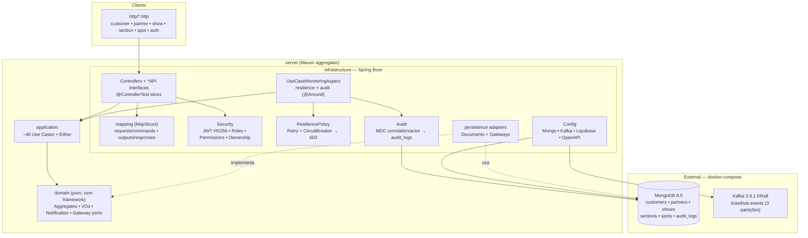
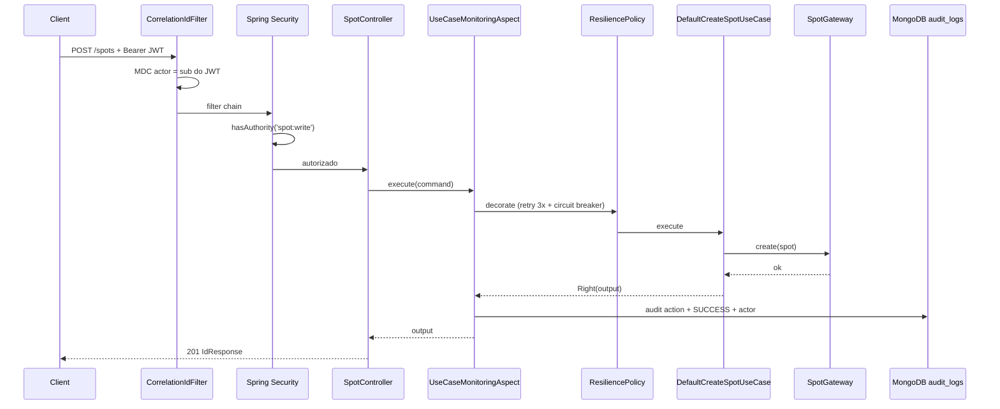
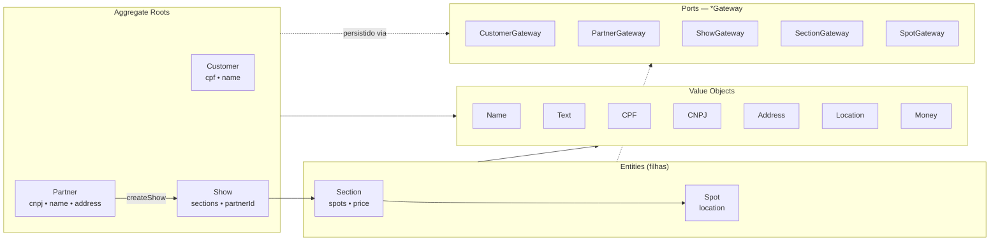

# TicketHub — Arquitetura

> Stack: Java 25 · Spring Boot 4 · MongoDB 8.0 · Kafka 3.9.1 (KRaft) · Maven multi-módulo.
> Decisões arquiteturais detalhadas em [`adr/`](./adr/).

## 1. Visão geral — módulos e infraestrutura

Regras de dependência (verificadas por ArchUnit em `ArchitectureTest`):

- `infrastructure → application → domain`. `domain` não conhece nenhum framework.
- Gateways (`*Gateway`) são **ports** definidos no `domain` e implementados na `infrastructure`.
- Controllers são finos: contrato/OpenAPI nas interfaces `*API`, conversão via MapStruct, chamadas diretas aos casos de uso com tradução `Either → HTTP` pelo `HttpResults`; resiliência e auditoria via aspecto.

## 2. Fluxo de uma requisição (ex.: `POST /spots`)

Notas do fluxo:

- **Resiliência**: só falha transitória entra no retry/circuito — `Left` cuja causa **não** é `DomainException`. Erro de validação (404/422) passa direto, sem retry.
- **Auditoria**: toda execução gera `AuditEntry` (action, correlationId, actor, input, outcome, error, durationMs). A escrita na trilha é best-effort: nunca quebra a requisição.
- **Segurança**: JWT `sub` vira o ator da auditoria (precedência sobre `X-Actor`).

## 3. Modelo de domínio

Entidades carregam auditoria de domínio (`createdAt`, `updatedAt`, `deletedAt`, `createdBy`, `lastModifiedBy`).

## 4. Autorização

| Recurso | Conta própria | Outro dono | Listagem |
|---|---|---|---|
| Customer | `customer:write`/`delete` + dono | 403 | só `ADMIN` |
| Partner | `partner:write`/`delete` + dono | 403 | só `ADMIN` |
| Show | dono do `partnerId` (`@showAccess`, claim `ownerId`) | 403 | pública (catálogo) |
| Section / Spot | dono via `partnerId` denormalizado (`@showAccess.canWriteSection/canWriteSpot`, fallback `showId`; órfão nega) | 403 | pública (catálogo) |

Cadastro (`POST /customers`, `POST /partners`) e login são públicos.

## 5. Testes

| Camada | Padrão | Onde |
|---|---|---|
| Unit (domain/application) | JUnit + Mockito | `*/src/test` |
| Slices MVC | `@ControllerTest` + JWT real | `infrastructure` |
| Arquitetura | ArchUnit | `ArchitectureTest` |
| Integração | `@IntegrationTest` + Testcontainers | `*IT` (failsafe, tag `integrationTest`) |
| Ponta a ponta | `@E2ETest` + MockMvc + Testcontainers | `*E2ETest` (failsafe, tag `e2eTest`) |

`MongoCleanUpExtension` limpa `audit_logs` antes de cada teste de integração. `mise run test` não exige Docker; `mise run integration` exige.
